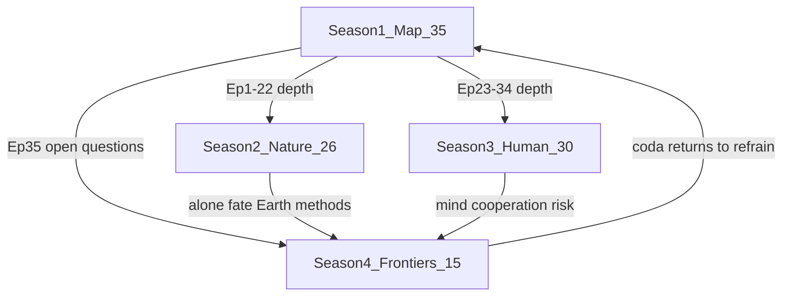

# Continuity Cross-Check (Phase 1)

Verification that seasons share one timeline and that depth seasons deepen Season 1 without breaking causal order.

---

## A. Season roles

| Season | Role | Episodes | Timeline logic |
|--------|------|----------|----------------|
| 1 — The Complete Story | Full summarized map | 35 | Cosmic → life → humans → present (slowed finale) |
| 2 — The Deep Universe | Natural-world mechanisms | 26 | Same cosmic→Earth→life→evolution order as S1 Ep. 1–22 |
| 3 — The Human Story | Human depth | 30 | Same human order as S1 Ep. 23–34 |
| 4 — Frontiers | Unfinished questions + coda | 15 | Near future → deep future → cosmos → meaning → synthesis |
| **Total** | | **106** | |

---

## B. Season-to-season architecture

| Exit | Hands to |
|------|----------|
| S1 Ep. 35 | S2, S3, S4 |
| S2 Ep. 21 | S4 Ep. 1–3 (life elsewhere) |
| S2 Ep. 5–6 cosmology / dark energy | S4 Ep. 13 (fate) |
| S2 Ep. 26 | Methods → S3 evidence culture; S4 search methods |
| S3 Ep. 27–28 | S4 Ep. 9 (future of cooperation) |
| S3 Ep. 29–30 | S4 Ep. 7–10, 14–15 |
| S4 Ep. 15 | Audience / future project phases |

---

## C. Season 1 baton chain (summary)

Episodes 1→35 remain a single causal chain (cosmos → present). Finale order locked:

28 Prehistory → 29 Cradles → 30 Axial → 31 Faiths/bonds → 32 Time → 33 Science to ~1940 → 34 After 1940 → 35 Coda

Full pairwise batons: see Season 1 file through-lines.

---

## D. Season 2 internal timeline

1–6 Cosmic stage → 7–11 Stars/galaxies → 12–16 Earth/oxygen → 17–21 Origin of life → 22–26 Evolution & major transitions / methods

Each episode lists a **Deepens:** S1 pointer.

---

## E. Season 3 internal timeline

1–7 Human evolution / Out of Africa → 8–12 Mind & Ice Age → 13–17 Prehistory & cradles → 18–22 Axial, faiths, time, medieval knowledge → 23–26 Scientific age to mid-century → 27–30 Post-1940 & synthesis

Matches S1 Ep. 23–34 beat-for-beat at depth.

---

## F. Season 4 internal timeline

1–3 Astrobiology/SETI → 4–6 Minds → 7–11 Earth/civilization/cooperation futures → 12–13 Deep Earth & cosmic fate → 14 Meaning → 15 Series coda

---

## G. Open questions — planted and revisited

| Open question | S1 | Depth |
|---------------|----|-------|
| Before Big Bang / initial conditions | 1–2 | S2 Ep. 1–3 |
| Matter–antimatter | 3 | S2 Ep. 4 |
| Dark matter | 5, 35 | S2 Ep. 6 |
| Dark energy / fate | 35 | S2 cosmology; S4 Ep. 13 |
| First stars / enrichment | 6 | S2 Ep. 7–9 |
| Galaxies / Milky Way / black holes | 7–8 | S2 Ep. 10–11 |
| Habitable Earth / water | 9–10 | S2 Ep. 12–15 |
| First life / definition / abiogenesis | 11–13 | S2 Ep. 17–21 |
| Oxygenation | 15 | S2 Ep. 16 |
| Eukaryotes / multicellularity | 16–17 | S2 Ep. 24 |
| Cambrian / extinction / mammals pattern | 18–22 | S2 Ep. 25 |
| Human bush / migrations | 24–25 | S3 Ep. 4–7 |
| Language / mind | 26 | S3 Ep. 8–11; S4 Ep. 4–5 |
| Ice Age / megafauna | 27 | S3 Ep. 12 |
| Prehistory / Neolithic | 28 | S3 Ep. 13–15 |
| Cradles | 29 | S3 Ep. 16–17 |
| Axial Age | 30 | S3 Ep. 18 |
| Faiths as social bonds | 31 | S3 Ep. 19–20; S4 Ep. 14 |
| Time / calendars / zones | 32 | S3 Ep. 21 |
| Science ~1500–1940 | 33 | S3 Ep. 22–26 |
| Post-1940 cooperation | 34 | S3 Ep. 27–28; S4 Ep. 9 |
| Alone / futures / meaning | 35 | S4 Ep. 1–15 |

---

## H. Recurring devices

| Device | Where |
|--------|-------|
| Evidence ladder | Series bible; every open-questions block |
| Master timeline zoom | `01-master-timeline.md`; S1; S3 Ep. 30; S4 Ep. 15 |
| Trees not ladders | S1 Ep. 23–24; S2 Ep. 23–25; S3 Ep. 1, 5; S4 Ep. 5 |
| Worldview windows | S1 Ep. 1, 13, 26, 30–32, 35; S3 Ep. 18–19; S4 Ep. 4, 14 |
| **Deepens:** tags | S2, S3, S4 episode headers |

---

## I. Phase 1 gaps deferred to Phase 2

1. Full act structures / evidence checklists / shot lists per episode  
2. Scientific advisor pass on dates and contested claims  
3. Partner pitch one-pager (Phase 4)  

---

## J. Continuity pass result

**Restructured S2–S4 align to S1’s timeline.** Nature depth (S2) and human depth (S3) mirror the map; Frontiers (S4) carries unfinished questions with cooperation and meaning in continuity with the slowed S1 finale.
